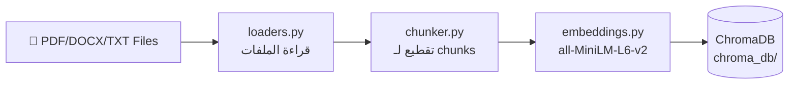
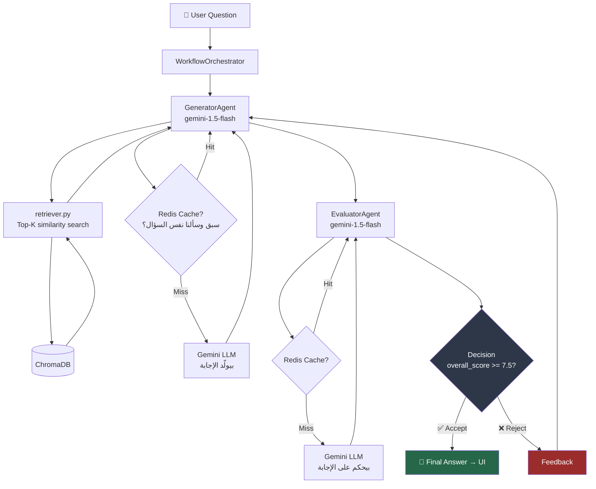

# 🏗️ Architecture — `chat_with_Doc`

## الـ Big Picture

الـ project ده عبارة عن **Evaluator–Generator RAG System** — يعني مش مجرد RAG عادي بيجيب إجابة وخلاص، ده بيعمل **feedback loop** بين agent بيولّد الإجابة وتاني بيحكم عليها.

---

## 📁 Folder Structure

```
chat_with_Doc/
│
├── agents/                  ← الـ LLM Agents
│   ├── generator.py         ← بيولّد الإجابة من الـ context
│   └── evaluator.py         ← بيحكم على جودة الإجابة
│
├── workflow/
│   └── orchestrator.py      ← بيدير الـ feedback loop بين الـ agents
│
├── ingestion/               ← بيحوّل الـ docs لـ vectors
│   ├── loaders.py           ← بيقرأ PDF/DOCX/TXT
│   ├── chunker.py           ← بيقطّع النص لـ chunks
│   ├── embeddings.py        ← بيعمل الـ embedding model
│   ├── vectorstore.py       ← بيتعامل مع ChromaDB
│   └── pipeline.py          ← بيجمّع كل الخطوات دي مع بعض
│
├── knowledge/               ← بيجيب المعلومات وقت الـ query
│   ├── retriever.py         ← بيعمل similarity search في ChromaDB
│   └── cache.py             ← Redis cache للـ LLM responses والـ evaluations
│
├── app.py                   ← Streamlit UI (الـ frontend)
├── config.py                ← كل الـ settings من .env
├── logger_config.py         ← Logging setup
├── stats_tracker.py         ← بيتابع الـ performance metrics
├── ui_styles.py             ← CSS styles للـ Streamlit
└── ingest_cli.py            ← CLI tool لـ ingestion الـ docs
```

---

## 🔄 Data Flow — الـ Pipeline

### Phase 1: Document Ingestion (مرّة واحدة)



### Phase 2: Question Answering (كل query)



---

## 🧠 الـ Agents بالتفصيل

### Generator Agent
| الجانب | التفاصيل |
|--------|----------|
| **Model** | `gemini-1.5-flash` (temperature=0.2) |
| **Memory** | `InMemoryChatMessageHistory` (isolated) |
| **Input** | Question + Context from ChromaDB + Evaluator Feedback |
| **Output** | Answer string + context_used |
| **Cache** | Redis — key = `question + iteration + feedback` |

### Evaluator Agent
| الجانب | التفاصيل |
|--------|----------|
| **Model** | `gemini-1.5-flash` (temperature=0.1 — أكثر دقة) |
| **Memory** | `InMemoryChatMessageHistory` (isolated — منفصلة تماماً عن Generator) |
| **يحكم على 6 أبعاد** | Accuracy, Relevance, Completeness, Grounding, No-Hallucination, Clarity |
| **Threshold للـ Accept** | `overall_score >= 7.5` AND `كل dimension >= 6.0` |
| **Output** | JSON: `{decision, overall_score, dimension_scores, feedback, reasoning}` |

---

## 🔁 الـ Feedback Loop

```
Iteration 1: Generator → Evaluator → Reject (score=5.2) → Feedback
Iteration 2: Generator (+ feedback) → Evaluator → Reject (score=6.8) → Feedback  
Iteration 3: Generator (+ feedback) → Evaluator → Accept (score=8.1) ✅
```

- **Max iterations**: 4 (من الـ config)
- لو وصلنا الـ max بدون accept → بيرجع آخر إجابة مع warning

---

## ⚡ Caching Layer (Redis)

```
Redis TTL: 1 hour (3600s)

Cached Objects:
├── LLM Responses   → key: "question|iterN|feedback"
└── Evaluations     → key: hash(question + answer)
```

> **الهدف**: تقليل الـ API calls وتسريع الـ repeated queries

---

## 🎨 Frontend (Streamlit)

- `app.py` — الـ main UI
- `ui_styles.py` — Dark theme CSS
- `stats_tracker.py` — بيعرض الـ analytics: iterations، scores، decisions

---

## 🔑 Key Design Decisions

1. **Isolated Memories**: كل agent عنده memory منفصلة — Generator مش شايف تاريخ Evaluator والعكس
2. **LCEL Composition**: الـ workflow مبني على LangChain LCEL `RunnableLambda`
3. **run() vs run_streaming()**: في طريقتين للتشغيل — واحدة عادية وواحدة بـ callback لكل iteration للـ live UI updates
4. **Conservative Fallback**: لو فشل الـ JSON parsing في Evaluator → يعمل reject تلقائياً بـ score=4.0
5. **Redis + ChromaDB**: Redis للـ LLM response cache، ChromaDB للـ vector store

